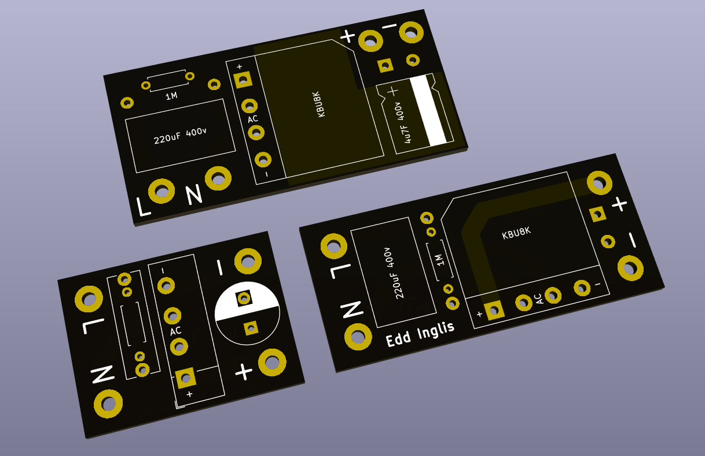
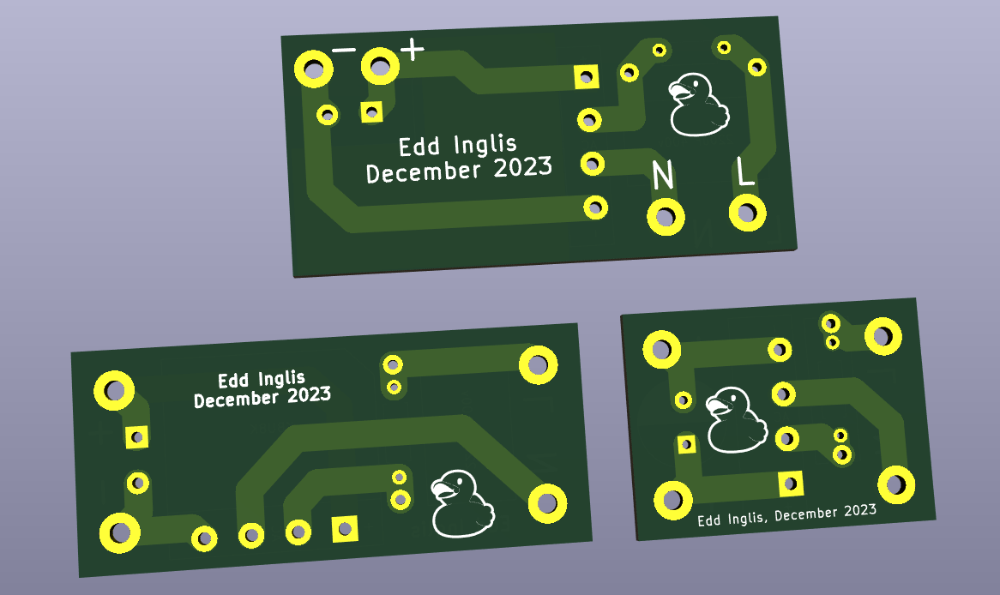

# Gate Light Capacitive Dropper

I bought some LED tape (https://www.amazon.co.uk/dp/B07KW4Q4R3) to make lights for my gateposts.

In stock trim, they're too bright, and they flicker in my peripheral vision, which is very annoying.

BigClive has a nice article about hacking LED bulbs here: https://bigclive.com/ledlmp.htm.  It applies equally well to these LED tapes.

Because I'm indecisive, I made three variants...

